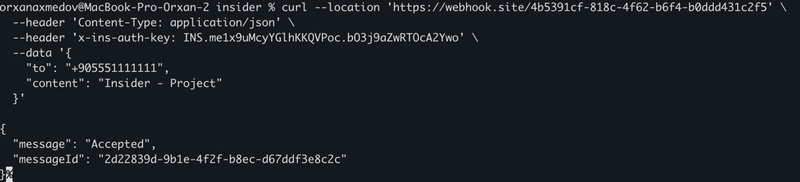

# Insider Message Sending System

Automatic bulk message sending system with Laravel 10, Redis queue, and rate limiting.

## For Reviewers - Fresh Installation Test

To verify the project works from scratch:

```bash
# 1. Clone and setup
git clone https://github.com/orhan17/insider.git
cd insider
cp .env.example .env

# 2. Start Docker (wait 10 seconds for MySQL to be ready)
docker-compose up -d
sleep 10

# 3. Install and setup
docker-compose exec app composer install
docker-compose exec app php artisan key:generate
docker-compose exec app php artisan migrate --seed

# 4. Verify everything works
docker-compose exec app php artisan test

# Expected: ✅ 27 tests passing

# 5. Test API
curl -X POST http://localhost:8081/api/v1/messages \
  -H "Content-Type: application/json" \
  -d '{"phone_number": "+905551111111", "content": "Test message"}'

curl -X GET http://localhost:8081/api/v1/messages

# 6. Process messages (after configuring webhook in .env)
docker-compose exec app php artisan messages:process
```

**Important:** `.env.example` is pre-configured for Docker. No manual configuration needed for database or Redis - it works out of the box!

## Features

- Bulk message sending via webhook
- Rate limiting: 2 messages per 5 seconds
- Asynchronous queue processing (Redis)
- Message status tracking (pending/sent/failed)
- Redis caching for sent messages
- RESTful API endpoints
- Repository Pattern + Service Layer
- Full test coverage (Unit + Feature)
- Code quality tools (Psalm, PHP-CS-Fixer, Deptrac)

## Quick API Examples

```bash
# Create a new message
curl -X POST http://localhost:8081/api/v1/messages \
  -H "Content-Type: application/json" \
  -d '{"phone_number": "+905551111111", "content": "Test message"}'

# Get all sent messages
curl -X GET http://localhost:8081/api/v1/messages


# Process pending messages (trigger queue)
make process
# or
docker-compose exec app php artisan messages:process

# Run all tests and quality checks
make test-all
```

## Quick Start

```bash
# 1. Clone repository
git clone https://github.com/orhan17/insider.git
cd insider

# 2. Copy environment file (already configured for Docker)
cp .env.example .env

# 3. Start Docker containers
docker-compose up -d

# 4. Install dependencies
docker-compose exec app composer install

# 5. Generate application key
docker-compose exec app php artisan key:generate

# 6. Run migrations and seed database
docker-compose exec app php artisan migrate --seed

# 7. Configure webhook (REQUIRED for message sending)
# a. Go to https://webhook.site
# b. Copy your unique URL (e.g., https://webhook.site/abc123-def456)
# c. On webhook.site, click "Edit" and set:
#    - Status code: 202
#    - Content type: application/json
#    - Content: {"message": "Accepted", "messageId": "$request.uuid$"}
# d. Edit .env file and set:
#    WEBHOOK_URL=https://webhook.site/abc123-def456
# e. Restart queue: docker-compose restart queue

# 8. Process messages
docker-compose exec app php artisan messages:process

# Application is ready at http://localhost:8081
```

**Note:** `.env.example` is pre-configured for Docker with correct service names (db, redis). Just copy it and start using!

**Webhook Setup:** See detailed webhook configuration in [Usage](#webhook-configuration) section below.

## API Endpoints

### Create Message
```bash
# cURL
curl -X POST http://localhost:8081/api/v1/messages \
  -H "Content-Type: application/json" \
  -d '{
    "phone_number": "+905551111111",
    "content": "Your message text here"
  }'

# Response (201 Created)
{
  "success": true,
  "message": "Message created successfully",
  "data": {
    "id": 1,
    "phone_number": "+905551111111",
    "content": "Your message text here",
    "status": "pending",
    "created_at": "2024-01-01T12:00:00Z"
  }
}
```

### Get Sent Messages
```bash
# cURL
curl -X GET http://localhost:8081/api/v1/messages

# Response (200 OK)
{
  "success": true,
  "data": [
    {
      "id": 1,
      "phone_number": "+905551111111",
      "content": "Your message text here",
      "status": "sent",
      "message_id": "67f2f8a8-ea58-4ed0-a6f9-ff217df4d849",
      "sent_at": "2024-01-01T12:00:05Z",
      "created_at": "2024-01-01T12:00:00Z",
      "updated_at": "2024-01-01T12:00:05Z"
    }
  ],
  "count": 1
}
```


## Usage

### Webhook Configuration

**Important:** To send messages, you need to configure a webhook URL.

#### Step 1: Get your unique webhook URL
- Go to https://webhook.site
- You'll receive a unique URL like `https://webhook.site/abc123-def456-ghi789`
- Keep this page open to see incoming requests

#### Step 2: Configure webhook.site response
To simulate a real webhook service, configure the response on webhook.site:

1. Click **"Edit"** button on webhook.site page
2. Set **Status code:** `202`
3. Set **Content type:** `application/json`
4. Set **Content:** 
   ```json
   {
     "message": "Accepted",
     "messageId": "$request.uuid$"
   }
   ```
5. Click **"Save"**

This configuration makes webhook.site return the expected response format.

#### Step 3: Update .env file
```bash
# Edit .env and paste your webhook.site URL
WEBHOOK_URL=https://webhook.site/abc123-def456-ghi789
WEBHOOK_AUTH_KEY=INS.me1x9uMcyYGlhKKQVPoc.bO3j9aZwRTOcA2Ywo
```

#### Step 4: Restart queue worker
```bash
docker-compose restart queue
```

#### Step 5: Test webhook
```bash
# Process pending messages
docker-compose exec app php artisan messages:process

# Check webhook.site page - you should see incoming POST requests
```

**Note:** Without a valid webhook URL and proper response configuration, messages won't be marked as sent.

For troubleshooting, see [WEBHOOK_TROUBLESHOOTING.md](WEBHOOK_TROUBLESHOOTING.md)

### Processing Messages

```bash
# Process pending messages
docker-compose exec app php artisan messages:process

# Queue worker runs automatically in separate container
docker-compose logs -f queue
```

## Architecture

- **Repository Pattern** - Data access abstraction
- **Service Layer** - Business logic (MessageService, WebhookService, CacheService)
- **Dependency Injection** - Clean dependencies
- **Queue/Job** - Async processing with retry logic
- **Commands** - CLI for message processing

## Testing

```bash
# All tests
docker-compose exec app php artisan test
# or
make test

# Run all tests + quality checks at once
make test-all

# Individual quality checks
make psalm                                        # Static analysis
make fix-cs                                       # Code style fix
make check-cs                                     # Code style check
make deptrac                                      # Architecture validation

# Or manually:
docker-compose exec app vendor/bin/psalm          # Static analysis
docker-compose exec app vendor/bin/php-cs-fixer fix  # Code style
docker-compose exec app composer deptrac          # Architecture validation
```

**Test Results:** 27 tests, 116 assertions, 100% passing

## Tech Stack

- Laravel 10.x
- PHP 8.2
- MySQL 8.0
- Redis 7
- Docker & Docker Compose


## Docker Services

| Service | Port  | Description          |
|---------|-------|----------------------|
| nginx   | 8081  | Web server           |
| db      | 33060 | MySQL 8.0            |
| redis   | 63790 | Cache & Queue        |
| app     | -     | PHP-FPM application  |
| queue   | -     | Queue worker         |

## Database Schema

**messages table:**
- `id` - Primary key
- `phone_number` - Recipient phone (E.164 format)
- `content` - Message text (max 160 chars)
- `status` - pending/sent/failed
- `message_id` - External webhook message ID
- `sent_at` - Timestamp when sent
- `created_at`, `updated_at` - Timestamps

## Useful Commands

```bash
# Quick start with Makefile
make up              # Start containers
make migrate         # Run migrations
make seed            # Seed database
make process         # Process pending messages
make test-all        # Run all tests + quality checks

# View logs
docker-compose logs -f queue

# Run tests
docker-compose exec app php artisan test
make test

# Run all tests and quality checks
make test-all

# Individual quality checks
docker-compose exec app vendor/bin/psalm              # Static analysis
docker-compose exec app vendor/bin/php-cs-fixer fix   # Code style
docker-compose exec app composer deptrac              # Architecture validation

# Clear cache
docker-compose exec app php artisan cache:clear

# Tinker
docker-compose exec app php artisan tinker
```

## Environment Variables

**Important:** `.env.example` is already configured for Docker. After `cp .env.example .env`, no manual changes needed unless you want to customize.

**Default Docker Configuration:**
```env
# Database (matches docker-compose.yml)
DB_HOST=db                    # Docker service name
DB_DATABASE=insider_db
DB_USERNAME=insider_user
DB_PASSWORD=insider_pass
DB_PORT=3306

# Redis (matches docker-compose.yml)
REDIS_HOST=redis              # Docker service name
REDIS_PORT=6379
CACHE_DRIVER=redis            # Required for caching
QUEUE_CONNECTION=redis        # Required for queues
SESSION_DRIVER=redis

# Webhook
WEBHOOK_URL=https://webhook.site/your-unique-id
WEBHOOK_AUTH_KEY=your-auth-key-here

# Message Settings (optional)
MESSAGE_RATE_LIMIT=2          # Messages per interval
MESSAGE_RATE_INTERVAL=5       # Seconds
MESSAGE_MAX_LENGTH=160        # Characters
```

**Troubleshooting:**
- If migration fails, ensure `DB_HOST=db` (not `127.0.0.1`)
- If cache/queue fails, ensure `REDIS_HOST=redis` and `CACHE_DRIVER=redis`
- Database and Redis services must be running: `docker-compose ps`

## Requirements Met

All Insider assessment requirements implemented:
- Repository Pattern + Service Layer
- Queue/Job/Worker structures
- Rate limiting (2 messages/5 seconds)
- Redis caching (messageId + timestamp)
- RESTful API standards
- Unit & Integration tests
- Clean Architecture & SOLID principles
- Laravel 10.x best practices
- Docker containerization
- Complete documentation

## License

MIT License

---

## Additional Information



